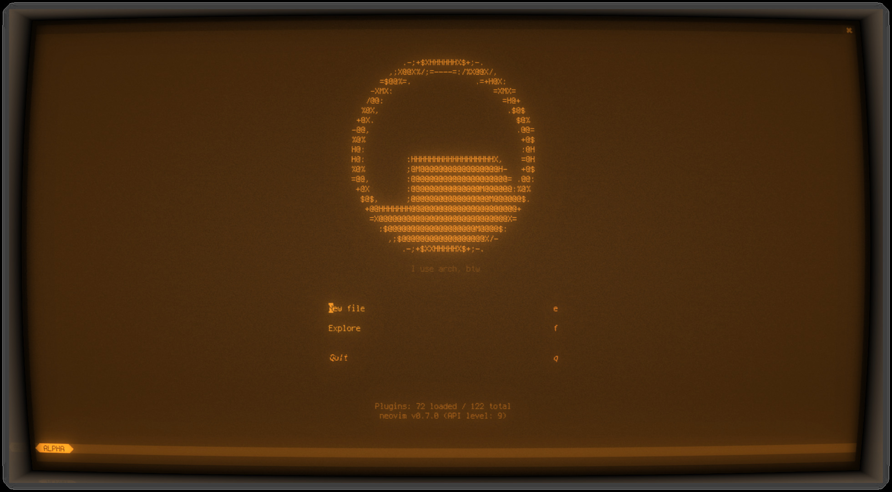

# nvim-config

## Plugins

### Colorscheme

- [catppuccin](https://github.com/catppuccin/nvim)
- [noctis.nvim](https://github.com/kartikp10/noctis.nvim)

### Helpers

- [auto-pairs](https://github.com/jiangmiao/auto-pairs)
- [cmp-buffer](https://github.com/hrsh7th/cmp-buffer)
- [cmp-calc](https://github.com/hrsh7th/cmp-calc)
- [cmp-cmdline](https://github.com/hrsh7th/cmp-cmdline)
- [cmp-emoji](https://github.com/hrsh7th/cmp-emoji)
- [cmp-latex-symbols](https://github.com/kdheepak/cmp-latex-symbols)
- [cmp-npm](https://github.com/David-Kunz/cmp-npm)
- [cmp-nvim-lsp](https://github.com/hrsh7th/cmp-nvim-lsp)
- [cmp-nvim-lsp-document-symbol](https://github.com/hrsh7th/cmp-nvim-lsp-document-symbol)
- [cmp-nvim-lsp-signature-help](https://github.com/hrsh7th/cmp-nvim-lsp-signature-help)
- [cmp-nvim-lua](https://github.com/hrsh7th/cmp-nvim-lua)
- [cmp-path](https://github.com/hrsh7th/cmp-path)
- [cmp-snippy](https://github.com/dcampos/cmp-snippy)
- [cmp-treesitter](https://github.com/ray-x/cmp-treesitter)
- [crates.nvim](https://github.com/saecki/crates.nvim)
- [document-color.nvim](https://github.com/mrshmllow/document-color.nvim)
- [headlines.nvim](https://github.com/lukas-reineke/headlines.nvim)
- [lean.nvim](https://github.com/Julian/lean.nvim)
- [lspsaga.nvim](https://github.com/glepnir/lspsaga.nvim)
- [lua-dev.nvim](https://github.com/folke/lua-dev.nvim)
- [mason-lspconfig.nvim](https://github.com/williamboman/mason-lspconfig.nvim)
- [mason.nvim](https://github.com/williamboman/mason.nvim)
- [neoformat](https://github.com/sbdchd/neoformat)
- [null-ls.nvim](https://github.com/jose-elias-alvarez/null-ls.nvim)
- [nvim-cmp](https://github.com/hrsh7th/nvim-cmp)
- [nvim-config-local](https://github.com/klen/nvim-config-local)
- [nvim-lint](https://github.com/mfussenegger/nvim-lint)
- [nvim-lspconfig](https://github.com/neovim/nvim-lspconfig)
- [nvim-snippy](https://github.com/dcampos/nvim-snippy)
- [nvim-treesitter](https://github.com/nvim-treesitter/nvim-treesitter)
- [overseer.nvim](https://github.com/stevearc/overseer.nvim)
- [package-info.nvim](https://github.com/vuki656/package-info.nvim)
- [persisted.nvim](https://github.com/olimorris/persisted.nvim)
- [playground](https://github.com/nvim-treesitter/playground)
- [rust-tools.nvim](https://github.com/simrat39/rust-tools.nvim)
- [SchemaStore.nvim](https://github.com/b0o/SchemaStore.nvim)
- [trouble.nvim](https://github.com/folke/trouble.nvim)
- [vim-easy-align](https://github.com/junegunn/vim-easy-align)
- [vim-mix-format](https://github.com/mhinz/vim-mix-format)

### Misc

- [bad-apple.vim](https://github.com/ryoppippi/bad-apple.vim)
- [denops.vim](https://github.com/vim-denops/denops.vim)

### Syntax / Languages

- [cranelift.vim](https://github.com/bytecodealliance/cranelift.vim)
- [ejs-syntax](https://github.com/nikvdp/ejs-syntax)
- [fluent.vim](https://github.com/projectfluent/fluent.vim)
- [gleam.vim](https://github.com/gleam-lang/gleam.vim)
- [iptables-vim](https://github.com/eiginn/iptables-vim)
- [lean.vim](https://github.com/leanprover/lean.vim)
- [ron.vim](https://github.com/ron-rs/ron.vim)
- [tabular](https://github.com/godlygeek/tabular)
- [vim-capnp](https://github.com/cstrahan/vim-capnp)
- [vim-css3-syntax](https://github.com/hail2u/vim-css3-syntax)
- [vim-dyon](https://github.com/thyrgle/vim-dyon)
- [vim-ebnf](https://github.com/killphi/vim-ebnf)
- [vim-fish](https://github.com/ericvw/vim-fish)
- [vim-gitignore](https://github.com/gisphm/vim-gitignore)
- [vim-hjson](https://github.com/hjson/vim-hjson)
- [vim-logrotate](https://github.com/moon-musick/vim-logrotate)
- [vim-orgmode](https://github.com/jceb/vim-orgmode)
- [vim-pico8-syntax](https://github.com/justinj/vim-pico8-syntax)
- [vim-polyglot](https://github.com/sheerun/vim-polyglot)
- [vim-ps1](https://github.com/PProvost/vim-ps1)
- [vim-rdf](https://github.com/niklasl/vim-rdf)
- [vim-smali](https://github.com/kelwin/vim-smali)

### UI

- [aerial.nvim](https://github.com/stevearc/aerial.nvim)
- [aerojump.nvim](https://github.com/ripxorip/aerojump.nvim)
- [alpha-nvim](https://github.com/goolord/alpha-nvim)
- [ccc.nvim](https://github.com/uga-rosa/ccc.nvim)
- [comment-box.nvim](https://github.com/LudoPinelli/comment-box.nvim)
- [committia.vim](https://github.com/rhysd/committia.vim)
- [competitest.nvim](https://github.com/xeluxee/competitest.nvim)
- [cosmic-ui](https://github.com/CosmicNvim/cosmic-ui)
- [ctrlp.vim](https://github.com/ctrlpvim/ctrlp.vim)
- [dressing.nvim](https://github.com/stevearc/dressing.nvim)
- [feline.nvim](https://github.com/feline-nvim/feline.nvim)
- [FTerm.nvim](https://github.com/numToStr/FTerm.nvim)
- [git-blame-virt.nvim](https://github.com/robert-oleynik/git-blame-virt.nvim)
- [gitsigns.nvim](https://github.com/lewis6991/gitsigns.nvim)
- [hydra.nvim](https://github.com/anuvyklack/hydra.nvim)
- [indent-blankline.nvim](https://github.com/lukas-reineke/indent-blankline.nvim)
- [legendary.nvim](https://github.com/mrjones2014/legendary.nvim)
- [lsp-status.nvim](https://github.com/nvim-lua/lsp-status.nvim)
- [marks.nvim](https://github.com/chentoast/marks.nvim)
- [minimap.vim](https://github.com/wfxr/minimap.vim)
- [modes.nvim](https://github.com/mvllow/modes.nvim)
- [navigator.lua](https://github.com/ray-x/navigator.lua)
- [nnn.nvim](https://github.com/luukvbaal/nnn.nvim)
- [nvim-bufferline.lua](https://github.com/akinsho/nvim-bufferline.lua)
- [nvim-colorizer.lua](https://github.com/norcalli/nvim-colorizer.lua)
- [nvim-notify](https://github.com/rcarriga/nvim-notify)
- [nvim-tree.lua](https://github.com/kyazdani42/nvim-tree.lua)
- [nvim-treesitter-context](https://github.com/nvim-treesitter/nvim-treesitter-context)
- [nvim-web-devicons](https://github.com/kyazdani42/nvim-web-devicons)
- [satellite.nvim](https://github.com/lewis6991/satellite.nvim)
- [skim.vim](https://github.com/lotabout/skim.vim)
- [telescope.nvim](https://github.com/nvim-telescope/telescope.nvim)
- [todo-comments.nvim](https://github.com/folke/todo-comments.nvim)
- [undotree](https://github.com/mbbill/undotree)
- [vim-fugitive](https://github.com/tpope/vim-fugitive)
- [vim-illuminate](https://github.com/RRethy/vim-illuminate)
- [virt-column.nvim](https://github.com/lukas-reineke/virt-column.nvim)
- [which-key.nvim](https://github.com/folke/which-key.nvim)

### Utilities

- [async.vim](https://github.com/prabirshrestha/async.vim)
- [bufdelete.nvim](https://github.com/famiu/bufdelete.nvim)
- [codi.vim](https://github.com/metakirby5/codi.vim)
- [Comment.nvim](https://github.com/numToStr/Comment.nvim)
- [direnv.vim](https://github.com/direnv/direnv.vim)
- [editorconfig-vim](https://github.com/editorconfig/editorconfig-vim)
- [emmet-vim](https://github.com/mattn/emmet-vim)
- [figban.nvim](https://github.com/thazelart/figban.nvim)
- [glow.nvim](https://github.com/ellisonleao/glow.nvim)
- [impatient.nvim](https://github.com/lewis6991/impatient.nvim)
- [isort.nvim](https://github.com/stsewd/isort.nvim)
- [kitty-runner.nvim](https://github.com/lkemitchll/kitty-runner.nvim)
- [lh-vim-lib](https://github.com/LucHermitte/lh-vim-lib)
- [markdown-preview.nvim](https://github.com/iamcco/markdown-preview.nvim)
- [mkdir.nvim](https://github.com/jghauser/mkdir.nvim)
- [neorg](https://github.com/nvim-neorg/neorg)
- [nvim-gomove](https://github.com/booperlv/nvim-gomove)
- [nvim-luapad](https://github.com/rafcamlet/nvim-luapad)
- [plenary.nvim](https://github.com/nvim-lua/plenary.nvim)
- [popup.nvim](https://github.com/nvim-lua/popup.nvim)
- [presence.nvim](https://github.com/andweeb/presence.nvim)
- [sort.nvim](https://github.com/sQVe/sort.nvim)
- [viewdoc.nvim](https://github.com/ray-x/viewdoc.nvim)
- [vim-better-whitespace](https://github.com/ntpeters/vim-better-whitespace)
- [vim-gnupg](https://github.com/jamessan/vim-gnupg)
- [vim-ingo-library](https://github.com/inkarkat/vim-ingo-library)
- [vim-python-pep8-indent](https://github.com/hynek/vim-python-pep8-indent)
- [vim-radical](https://github.com/glts/vim-radical)
- [vim-repeat](https://github.com/tpope/vim-repeat)
- [vim-sensible](https://github.com/tpope/vim-sensible)
- [vim-surround](https://github.com/tpope/vim-surround)
- [vim-visual-multi](https://github.com/mg979/vim-visual-multi)

### Uncategorized

- [packer.nvim](https://github.com/wbthomason/packer.nvim)

### Third-party dependencies

- [guihua.lua](https://github.com/ray-x/guihua.lua)
- [lspkind-nvim](https://github.com/onsails/lspkind-nvim)
- [lush.nvim](https://github.com/rktjmp/lush.nvim)
- [nui.nvim](https://github.com/MunifTanjim/nui.nvim)
- [nvim-ts-context-commentstring](https://github.com/JoosepAlviste/nvim-ts-context-commentstring)
- [vim-magnum](https://github.com/glts/vim-magnum)
